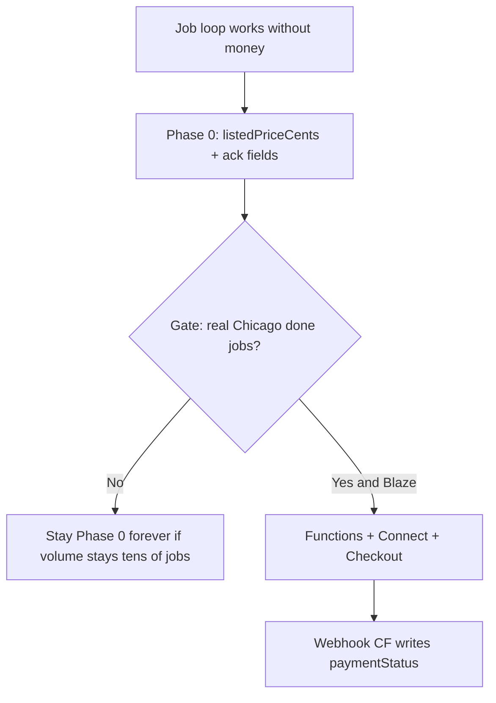

# SafetyNet Payment Processing Plan

| Field | Value |
| --- | --- |
| **Title** | Payment processing for the SafetyNet job marketplace |
| **Author** | SafetyNet engineering (draft) |
| **Date** | 2026-09-08 |
| **Status** | Draft (revision 3) |
| **Repo** | `/Users/asif/Documents/projects/safety-net` (GitHub `ahazrat/safety-net`) |
| **Live Firebase** | `safety-net-2022` |
| **Related** | `docs/ROADMAP.md`, `packages/shared/types/Listing.ts`, `firestore.rules`, `packages/shared/firebase/firestore.js` |

---

## Overview

SafetyNet already runs a two-sided job loop without money: a requester creates a listing (`createListing` stamps `ownerUid`, `status: 'open'`), a provider accepts (`acceptListing` sets `assigneeUid` + `accepted`), then `setListingStatus` moves `accepted → in_progress → done`. Direct messages exist. There is **no take rate**, **no processor**, and **no Cloud Functions** in the live app (`firebase.json` has Firestore rules + emulator only; no `functions` key; no `httpsCallable` in the client). Legacy web listings carried `btcAdd`; that rail is dead. `requirements.stake` is a **score**, not a bond. **Do not change `requirements.stake` in any payments PR.**

This plan is incremental:

1. **Phase 0 (now, before payments):** persist **listed price** (client) and **proposed executed / ack flags** (client). **`executedPriceCents` and `paymentStatus` are never client-writable.** A callable (Phase 1 Functions) is the only writer of executed price and `recorded_off_platform`. GTM remains “free to post/accept.”
2. **Phase 1 (gate):** turn on Stripe only after a Chicago roster has **real completed jobs** (defined below). Requires **Blaze** (unverified on `safety-net-2022` today).
3. **Phase 2:** Stripe Connect Express, **web Checkout Session** with PaymentIntent `capture_method=manual` and `transfer_data.destination`. Stripe is source of truth for money; Firestore mirrors status via **webhook Cloud Functions** only.

Providers are **independent contractors**, not employees. Copy must not imply 911 replacement. Weapons badges stay in the data model but are not a payments product.

---

## Background & Motivation

### Current state

| Piece | Reality |
| --- | --- |
| Job lifecycle | `open → accepted → in_progress → done` in `firestore.rules` + `firestore.js` |
| Who can `update` | **Owner** (and `isAdmin()`) may update the listing without `jobContentUnchanged()` — they can today write arbitrary extra fields. **Assignee** may only change status along `open→accepted` (self as assignee) or `accepted\|in_progress\|done` with content unchanged. Rules do **not** prevent `done → accepted`. |
| Stake | `requirements.stake` number (`ListingCreate` hardcodes `15`); UI `Stake: N`. ROADMAP groups “Payments / stake / BTC” as not built — **stake is still not dollars.** |
| BTC | `btcAdd` on legacy web listing shape; not modeled in `Listing.ts`; ignore on create |
| Price API | Copy only (`apps/app/components/Services/index.tsx`). v1 “API” = read last `executedPriceCents` on public listings already loaded; **no new collection** |
| Trello | “Record the listed and executed price”; also “Create a base cloud function” (`docs/trello/features-for-development.md`) |
| Roadmap | Payments **last** after real completed jobs (priority 7); EAS iOS (priority 5) before charging in the store app |
| Volume | Chicago beachhead; **tens of jobs**, not thousands |
| Backend | Firebase JS SDK v9, rules v2; **no Cloud Functions**, no App Check, no Remote Config in Expo |
| Stripe / Blaze | **Unverified** whether `safety-net-2022` is on Blaze (required for outbound HTTP + Stripe). Do not assume. |

Pain: requesters and providers cannot record what a contract cost. Fake money (client-set `paid: true` or owner-set `paymentStatus: captured`) would be worse than no payments — **owner updates are the hole** unless rules lock payment fields on **every** client path including owner and admin **users**.

### Pain points if we skip the gate

Charging before density exists: Stripe Connect onboarding friction, App Store review questions, money-transmission and 1099 complexity, and support for disputes on a product that still has empty maps.

---

## Goals & Non-Goals

### Goals

- Record listed USD prices without a processor; record executed price only via Admin SDK / callable.
- When gated, collect job price from requester and pay the assignee as a contractor via Stripe Connect.
- Keep job status independent of payment until capture policy is explicit.
- Stripe as money source of truth; Firestore as product source of truth for jobs.
- Client-safe: publishable key only; **`paymentStatus`, `executedPriceCents`, `stripe*`, `platformFeeBps` writable only by Admin SDK.**

### Non-goals (v1)

- Stake-as-bond. Keep `requirements.stake` as a score; optional UI label “Stake score” later, not in PR 1 dollars work.
- BTC / on-chain settlement.
- Featured-listing ads, take rate > 0.
- Teams payroll, split payouts.
- 911, insurance, weapons matching as a paid SKU.
- Employer/W-2.
- IAP of labor; native Payment Sheet.
- Django / Cloud SQL revival.
- Shipping Stripe on iOS before EAS production listing exists.

---

## Proposed Design

### When to turn money on



**Product gate (not a PR merge checkbox):** at least **5** listings with `status == 'done'`, **distinct real** `ownerUid` and `assigneeUid` (not the same person, not known seed/faker uids), **lat/lng in a Chicago gate region**. Do **not** query `location.city` (`ListingCreate` writes only `{ lat, lng }`). Gate geometry is **ambiguous on purpose** and lives in `packages/shared/chicago/geo.js`:

- **Default:** axis-aligned **box** (`CHICAGO_GATE_BOX`: lat 41.64–42.08, lng −87.94–−87.50).
- **Also allowed:** **circle** (center + `radiusKm`) and **polygon** (lat/lng ring, ray-casting).
- Ops may swap `kind` when counting the five jobs; mixed specs are valid. If the script is noisy, **manual review** of five `done` pins is enough.

**Ops gate:** Firebase project on **Blaze**; Functions API enabled. If Blaze cannot be confirmed, **do not deploy PR 3 HTTP endpoints to production.**

**Stay Phase 0** is an explicit success path if volume stays tens of jobs and nobody wants Connect KYC.

### What money actually is

| Concept | v1 treatment |
| --- | --- |
| **Job price** | USD cents the requester agrees to pay. Primary money object. |
| **Listed price** | Owner-set at create/edit while `open` **and** `paymentStatus` in `none`/absent. Optional in the create form (omit = “no price set”). Integer ≥ 0; **0 means volunteer**, not missing. |
| **Executed price** | Set **only** by callable/webhook. Stripe jobs: always equals `listedPriceCents` from checkout (no mid-job repricing). Off-platform: callable copies dual-ack proposed cents. |
| **Stake / bond** | **Not money.** Do not map to Stripe. Do not retask `requirements.stake` as dollars because ROADMAP says “Payments / stake.” |
| **Featured listing** | Parked. |
| **Take rate** | `platformFeeBps` from **server config only** (default 0). Never a client/listing field owners can zero out or inflate. |

### Rail choice (locked for v1)

**Primary: Stripe Connect Express + Checkout Session on web + PaymentIntent `capture_method=manual` + `transfer_data.destination`.** Set `application_fee_amount` from server `platformFeeBps` **only when bps > 0**; if bps is 0, **omit** the field (do not send `0`).

Native: **open the Checkout URL** in `expo-web-browser` (already a dependency). **Park Payment Sheet** and any native Stripe SDK.

If Connect Express **cannot** destination-charge on the live account (Dashboard / counsel check), **stop** — that is a blocking ops check **before** PR 5, not an in-PR swap to separate charges + transfers.

| Rail | v1 |
| --- | --- |
| Stripe Connect Express + destination + Checkout | **Yes** |
| Payment Sheet / native Stripe SDK | No |
| Separate charges + transfers | Only if destination is blocked; then re-review MTL — not silent fallback |
| PayPal | No |
| Cash / Venmo off-platform | Yes, recorded via callable |
| BTC | No |

### Merchant of record and tax forms

- **Job labor:** connected account is MoR for destination charges; SafetyNet is the platform. Not the employer.
- **1099-K:** Stripe Connect reporting; do not hard-code thresholds.
- Do **not** choose platform-MoR + delayed payouts from platform balance (MTL).
- **Illinois does not charge sales tax on services** (including this labor). Do not collect Illinois sales tax on jobs. MTL / 1099-K remain counsel topics, not a tax-on-price feature.
- ToS: independent contractor; no 911; badges ≠ licenses.

### Lifecycle

**Accept never creates a PaymentIntent.** Repo `acceptListing` stays `{ status, assigneeUid }` only. GTM: free to accept without Connect.

```mermaid
sequenceDiagram
  participant R as Requester ownerUid
  participant App
  participant FS as Firestore listing
  participant CF as Cloud Functions
  participant S as Stripe
  participant P as Provider

  R->>App: create listing, optional listedPriceCents
  App->>FS: status open, no paymentStatus or none
  P->>App: Accept (no Stripe)
  App->>FS: accepted + assigneeUid
  alt stripeEnabled AND listedPriceCents greater than 0 AND connectOnboardingComplete
    R->>App: Pay to authorize
    App->>CF: createJobCheckout listingId
    CF->>S: Checkout Session manual capture destination
    R->>S: authorize card
    S->>CF: webhook
    CF->>FS: paymentStatus authorized
  else volunteer or no Connect or flag off
    Note over App: off-platform acks only; no PI
  end
  P->>FS: in_progress then done
  CF->>S: capture only if authorized
  S->>CF: payment_intent.succeeded
  CF->>FS: captured, executedPriceCents equals listed
```

| Event | Money | Job status |
| --- | --- | --- |
| Create | none | `open` |
| Accept | none | `accepted` |
| Owner Pay (optional) | Checkout if gates pass | still `accepted` |
| Auth success | `authorized` | `accepted` |
| Start work | none | `in_progress` |
| Mark done | capture **iff** `paymentStatus == authorized` | `done` |
| Volunteer (`listedPriceCents == 0` or omitted) | skip Checkout; callable rejects Stripe amount 0 | any |
| No Connect on assignee | UI: off-platform only; callable rejects missing destination / charges_enabled | `accepted` |
| No-show | cancel PI; never capture | see status rules |
| Dispute | Stripe webhooks → `disputed` | historical `done` stays |

**Who may set `done` (rules, before capture Function):**

- **Assignee** may transition `accepted → in_progress → done` (forward only).
- **Owner** may set `in_progress` or `done` only if current status is `accepted` or `in_progress` (not from `open`).
- **Neither** may move `done` back to `accepted`/`in_progress`/`open` (forward-only after `accepted`).
- **Admin users (`isAdmin()`) get the same payment-field lock as owners.** They must **not** mark jobs paid in Firestore. Ops use Stripe Dashboard + Functions. `isAdmin()` is not a money backdoor.

**Capture Function (`captureOnDone`):**

- Trigger: Firestore `onUpdate` on `listings/{id}` when `status` becomes `done`, **or** callable after done.
- No-op unless `paymentMethod == 'stripe'` **and** `paymentStatus == 'authorized'` **and** feature flag on **and** `stripePaymentIntentId` set.
- Capture **at most once** per `stripePaymentIntentId` (idempotency key = that id; ignore repeat `done` writes).
- Capture amount = **original authorized `listedPriceCents`** (no partial capture in v1).
- Never capture off-platform or `paymentStatus none`.
- If PI already succeeded/canceled, write mirror only.

**Auth TTL:** Uncaptured PaymentIntents **do not** support subscription-style `cancel_at`; they expire on Stripe’s ~7-day authorization window. `dateRange` is calendar dates only (`Listing.ts`), timezone America/Chicago. v1: Cloud Scheduler / scheduled Function lists `authorized` PIs and cancels when **Chicago date > `dateRange.end` (end of that calendar day in America/Chicago)** **or** PI created **> 7 days ago**. Optional extra: cancel if still `authorized` and never `in_progress` after `dateRange.start` 00:00 America/Chicago + 24h. Do not set `cancel_at` on the PI.

**Refunds:** owner-initiated via callable → Stripe refund while captured. Clients cannot set `refunded`.

### Data model

Keep `requirements.stake` unchanged.

```ts
// packages/shared/types/Listing.ts — additive
listedPriceCents?: number // int >= 0 if present; omit = no price set
currency?: 'usd'          // if listedPriceCents present, must be usd
// Client ack path for off-platform (NOT executed, NOT paymentStatus).
// Two proposed amounts so “both acked” means both numbers equal.
proposedExecutedPriceCentsOwner?: number
proposedExecutedPriceCentsAssignee?: number
executedPriceAckOwner?: boolean
executedPriceAckAssignee?: boolean
// Admin SDK / Functions only from here down:
executedPriceCents?: number
paymentStatus?:
  | 'none'
  | 'checkout_open'
  | 'authorized'
  | 'captured'
  | 'canceled'
  | 'refunded'
  | 'disputed'
  | 'recorded_off_platform'
stripeCheckoutSessionId?: string
stripePaymentIntentId?: string
stripeChargeId?: string
paymentMethod?: 'stripe' | 'off_platform' | 'none'
```

**`platformFeeBps` lives on `config/payments` (server-written), not on the listing.**

**Subcollection:** `listings/{id}/payments/{piId}` Admin-only.

**Provider Connect:** collection `connectAccounts/{uid}` — **no client write**. Fields: `stripeConnectAccountId`, `chargesEnabled`, `connectOnboardingComplete`, updated by `account.updated` webhook. Callables always key by `context.auth.uid`. **Never take Connect account id from client payload.** Do not store these on `users/{uid}` (owners can already patch most user fields).

**Create-time rules (PR 1):**

- `listedPriceCents` optional; if present: int ≥ 0 (no floats).
- `currency` only `'usd'` if present; if cents present, currency must be `usd` or absent (default usd in app).
- Forbid `stripeCheckoutSessionId`, `stripePaymentIntentId`, `stripeChargeId` on create.
- Forbid `executedPriceCents` on create.
- `paymentStatus` absent or `'none'` only.
- Ignore/drop `btcAdd` if sent.
- Ack fields default absent/false. PR 1 may omit ack fields entirely (they land in PR 2).

**Update-time rules (PR 1, all client paths including owner and admin):**

```
function paymentFieldsUnchanged() {
  // executedPriceCents, paymentStatus, stripe*, paymentMethod
  // must equal resource (or both absent)
}

allow update: if ... && paymentFieldsUnchanged() && (
  // existing owner/assignee/admin job rules, AND:
  // owner may change listedPriceCents/currency only if
  // listingStatus == open && paymentStatus in none/absent
)
```

`setListingStatus` remains `updateDoc({ status })` — must still satisfy `paymentFieldsUnchanged()` (other fields unchanged copies).

**PR 1 also:** forward-only status after `accepted` (see Who may set `done`).

**PR 2 ack rules (not payment fields):** owner may write only `proposedExecutedPriceCentsOwner` + `executedPriceAckOwner`; assignee only their pair; `isAdmin()` cannot forge the other party. Changing owner proposed cents does not write assignee ack. Invariant for `confirmOffPlatformPrice`: both acks true **and** the two proposed amounts are equal.

**Tests:** owner cannot set `captured`; admin user cannot set Stripe ids; create rejects `paymentStatus != none`; assignee cannot set `executedPriceCents`; owner cannot set assignee ack; owner cannot `open → done`.

**Lock listed price:** once `paymentStatus` is `checkout_open` or `authorized` (Functions-written), clients cannot change `listedPriceCents`.

### Firestore vs Stripe; webhooks

| Fact | Source of truth |
| --- | --- |
| Job title, pin, status, assignee | Firestore |
| Money moved | Stripe |
| UI “Paid $X” | Firestore mirror, webhook/callable only |

**Ops prerequisite (unverified until someone opens Firebase console):**

- Blaze billing on `safety-net-2022`
- Cloud Functions API enabled
- Extend `firebase.json` with `functions` + emulator
- **2nd gen** HTTPS functions, region **`us-central1`**
- Secrets: `STRIPE_SECRET_KEY`, `STRIPE_WEBHOOK_SECRET` in Secret Manager; bind to the webhook function
- **Raw body:** 2nd gen Cloud Functions (Cloud Run) — verify Stripe signature on the **unparsed** request body (`req.rawBody` in Firebase Functions v2 `onRequest`, or disable JSON parser). Document in PR 3: do not use a middleware that parses JSON before `constructEvent`.
- Client `firebase/functions` + `httpsCallable` added in **PR 5** (Checkout), not the skeleton PR 3
- App Check: optional later; not in app today

**Webhook event allowlist:**

- `checkout.session.completed`
- `payment_intent.amount_capturable_updated`
- `payment_intent.succeeded`
- `payment_intent.canceled`
- `charge.refunded`
- `charge.dispute.created`
- `account.updated`

Unknown events: 200 + log, no Firestore write.

Idempotency: `stripePaymentIntentId` / event id in `listings/.../payments` or `stripeEvents/{eventId}`.

**Callables:**

```js
createJobCheckout({ listingId }) // auth = owner; reject if !flag, cents==0, no Connect, !chargesEnabled
createConnectOnboardingLink()    // uid = context.auth.uid only
confirmOffPlatformPrice({ listingId }) // see invariant below
requestRefund({ listingId })
cancelAuthorizedPaymentsForListing({ listingId }) // rollback helper
```

### Client security and rules

- Publishable key in app only.
- **`paymentFieldsUnchanged()` on all client updates, including owner and `isAdmin()`.** Admin SDK bypasses rules; human admins in the app do not.
- Owner `listedPriceCents` only while `open` + payment none.
- Feature flag: Firestore `config/payments` document: `stripeEnabled: boolean`, `platformFeeBps: number`. **`allow get` if signed in; no client write.** (Remote Config is not in the Expo app; do not depend on it.)

### App Store / Play IAP

Labor is real-world services — **not IAP**. Guideline 3.1.3(e) (physical goods / services outside the app) **must be re-read at submission**; this draft does not quote live Apple/Google text.

Native Checkout via `expo-web-browser` / SFSafariViewController is preferred over an in-app WKWebView. Review notes: contracting local independent providers; Stripe Connect; not digital content.

**Do not ship Stripe on the iOS binary until EAS production listing exists** (ROADMAP item 5 before 7). Web + Android can use Checkout earlier behind the flag.

Featured pin (digital ranking) might need IAP — keep out of v1.

### BTC

Do not collect or display Bitcoin addresses. Ignore `btcAdd`.

### Legal

Marketplace facilitator + destination charges; counsel on MTL / FinCEN / Illinois. ToS before **live** charges; draft ToS can land before the flag (PR 4.5 / with PR 3 docs), not only when the flag flips.

### Minimum viable sequence

1. Schema + UI listed price; ack fields; **rules lock payment fields**; do not change stake.
2. Off-platform: dual-ack **booleans + proposed cents** on the listing (client). **No** `paymentStatus` / `executedPriceCents` from clients.
3. After Blaze: Functions skeleton with **signature-verified** webhook (no unsigned public HTTP). `confirmOffPlatformPrice` callable writes executed + `recorded_off_platform`.
4. Connect Express onboarding.
5. Checkout + capture-on-done + client SDK.
6. Flag on after product gate; store notes; ToS.

**Load:** tens of jobs/month; webhook p95 < 2s to Firestore.

### Risks

| Risk | Severity | Mitigation |
| --- | --- | --- |
| Owner/admin spoof `captured` | High | `paymentFieldsUnchanged` on all client updates in PR 1 |
| Capture on spoofed `done` | High | Forward-only status rules; capture only if `authorized` |
| Spark/Blaze | High | Unverified; no prod HTTP until Blaze |
| MTL | High | Destination charges; no platform wallet |
| Express cannot destination-charge | High | Blocking Dashboard check before PR 5 |
| IAP / WKWebView | Medium | Browser; no iOS Stripe before store listing |
| Unsigned webhook | High | PR 3 must verify signature or not deploy HTTP |

---

## API / Interface Changes

**Phase 0 — `createListing` / `apps/app/components/ListingCreate/index.js`:** optional `listedPriceCents` (integer ≥ 0). Omit allowed (“no price set”). Display on `Listing/index.js`, `Listings/index.js`, `apps/app/components/Jobs/index.jsx`. **Do not change `requirements.stake`.** UI may later say “Stake score”; not required in PR 1.

**`acceptListing` / `setListingStatus`:** unchanged payloads.

**Pay to authorize:** owner-only button when flag on, `listedPriceCents > 0`, assignee `connectAccounts/{uid}.connectOnboardingComplete`.

**Price API (v1):** no new endpoint. Public listing reads already include `listedPriceCents` / (Functions-set) `executedPriceCents`. Services screen copy stays marketing until a later aggregate.

---

## Data Model Changes

Additive fields above. No backfill. Missing `listedPriceCents` ≠ 0.

`config/payments` created by admin/console or Functions: `{ stripeEnabled: false, platformFeeBps: 0 }`.

---

## Alternatives Considered

1. **Immediate capture at accept.** Worse no-show. Rejected.
2. **PayPal primary.** Rejected.
3. **SafetyNet MoR + platform balance payouts.** MTL/payroll. Rejected.
4. **BTC primary.** Rejected.
5. **Featured-pin IAP only.** Does not record job prices. Rejected as v1 rail.
6. **Phase 0 forever (record listed price + acks; no Functions, no Stripe).** Valid if the gate never trips or Blaze is declined. Lowest MTL/ops cost; no in-app payouts; Price API is just listing fields. **This is the default until gates pass — PR 3–6 are optional.**
7. **Stripe Payment Links without Connect.** Requesters pay SafetyNet; contractors unpaid in-app. Rejected for contractor payouts.
8. **Native Payment Sheet in PR 5.** Two products. Parked.

---

## Security & Privacy Considerations

- Threat: forged paid jobs via owner `update`. Mitigation: payment fields immutable for all clients including `isAdmin()`.
- Threat: owner changes price after auth. Mitigation: lock cents after `checkout_open`.
- Threat: client supplies attacker Connect id. Mitigation: `connectAccounts/{uid}` Admin-only; callable uses auth uid.
- No PAN in Firestore. Log `paymentIntentId`, `listingId`, cents.
- Public listings may show listed price.

---

## Observability

**Log fields:** `listingId`, `uid`, `stripeEventId`, `stripePaymentIntentId`, `paymentStatus`, `listedPriceCents`, `outcome` (ok|noop|reject). Never card data.

**Metrics:** `checkout.created`, `pi.authorized`, `pi.captured`, `pi.canceled`, `webhook.signature_fail`, `capture.mismatch`, `confirm_off_platform`.

**Alert:** signature failures > 0 in 15m; Function errors.

**Rollback:** set `config/payments.stripeEnabled = false`. Callable/script: list listings with `paymentStatus == authorized`, cancel those PIs via Stripe API (`cancelAuthorizedPaymentsForListing` or admin script). Do not only “use Dashboard” without a named path.

---

## Rollout Plan

1. PR 1 fields + **rules lock** (no Stripe).
2. Stripe **test mode**; never live keys in Expo.
3. Flag `config/payments.stripeEnabled` default **false**.
4. Blaze + Functions emulator locally.
5. One internal job test mode then $1 live after gate.
6. No Stripe in iOS store build until EAS listing + review notes.

---

## Open Questions

- MTL / 1099-K reporting: **counsel** (not a PR blocker for Phase 0). Illinois sales tax on services: **none** (user decision).
- Chicago gate: box default; circle and polygon supported (`chicago/geo.js`). Manual pin review still allowed.
- Whether `expo-web-browser` vs `Linking.openURL` for Checkout on Android.

Resolved in Key Decisions: dual-ack vs owner-only; auth TTL; Express vs Standard; store vs Stripe order; who writes executed price; `platformFeeBps` location; who may set `done`.

---

## References

- `docs/ROADMAP.md` — payments last; no take rate; stake not money; BTC dead; contractors; no 911; EAS iOS before store payments
- `packages/shared/types/Listing.ts` — `requirements.stake`; legacy `btcAdd`
- `firestore.rules` — listing lifecycle; owner full update vs assignee `jobContentUnchanged`
- `packages/shared/firebase/firestore.js` — `createListing`, `acceptListing`, `setListingStatus`
- `apps/app/components/Listing/index.js`, `ListingCreate/index.js`, `Listings/index.js`, `apps/app/components/Jobs/index.jsx`
- `apps/app/components/Account/index.jsx` — Connect onboarding UI target
- `apps/app/components/Services/index.tsx` — Price API copy
- `docs/trello/features-for-development.md` — listed/executed price; base cloud function
- `firebase.json` — rules + Firestore emulator only today
- Stripe Checkout `payment_intent_data.capture_method`, Connect destination charges
- Apple App Store Review Guideline 3.1.3(e) — re-verify at submission

---

## Key Decisions

1. **Do not collect money until real Chicago `done` jobs exist (gate: ≥5 done jobs, distinct real owner/assignee, lat/lng in box by default, or circle/polygon).** Rationale: roadmap priority 7; geometry is ops-flexible.
2. **Phase 0 is listed price + off-platform ack fields only; executed money fields are Admin/callable-only.** Rationale: owner updates can spoof otherwise.
3. **v1 rail is Stripe Connect Express + web Checkout Session + manual capture + `transfer_data.destination`.** Native uses `expo-web-browser`. Payment Sheet parked. Destination-charge inability is a **hard stop**, not a silent swap.
4. **`requirements.stake` stays a score; payments PRs must not change it.** Rationale: ROADMAP grouping is not a schema instruction.
5. **BTC is not implemented; ignore `btcAdd`.**
6. **Stripe is source of truth for card money; webhooks/Admin are the only writers of `paymentStatus` and `executedPriceCents`.** Off-platform executed price uses the same callable rule (`confirmOffPlatformPrice`), not client dual-write of those fields.
7. **Take rate 0 from `config/payments.platformFeeBps`, server-only.** Not a listing field.
8. **Labor is not IAP.** No Stripe on iOS store binary until EAS listing. Prefer system browser for Checkout.
9. **SafetyNet is not the employer; Connect account is MoR for labor.**
10. **Off-platform cash is first-class via per-party proposed cents + acks + callable, not fake `captured`.** Each party writes only their proposed cents and ack; callable requires both acks true, amounts equal, caller is owner or assignee, and no in-flight Stripe (`paymentStatus` absent/`none`/`canceled` and no live `stripePaymentIntentId`). Never overwrite `captured`/`disputed`.
11. **`paymentFieldsUnchanged()` applies to owner, assignee, and admin users.** Only Admin SDK writes money fields.
12. **Accept never creates a PaymentIntent.** Pay is a follow-up; volunteer (`listedPriceCents` 0 or omitted) and missing Connect skip Stripe; callable rejects those.
13. **Forward-only job status after accept (PR 1 rules, not deferred to PR 5);** assignee or owner may set `done` from `accepted`/`in_progress`; capture Function no-ops unless Stripe `authorized`; once per PI.
14. **Connect Express only (not Standard) for v1.** Onboarding hosted Account Links.
15. **Lock `listedPriceCents` after `checkout_open`/`authorized`.** Stripe capture amount = that listed amount; no mid-job repricing.
16. **Auth TTL: scheduled cancel when Chicago date > dateRange.end or PI age > 7 days. No Stripe `cancel_at` on the PI.**
17. **Connect state in `connectAccounts/{uid}`, no client writes; never trust client-supplied account ids.**
18. **Stay Phase 0 (no Functions) if Blaze/gate fail** — valid alternative, not a failed project.
19. **ToS/contractor language can merge before `stripeEnabled`; live charges cannot.**
20. **No Illinois sales tax on job labor.** Services are not taxed in Illinois; do not add a tax line.

---

## PR Plan

### PR 1 — Listing listed price + payment-field immutability (no processor)

- **Title:** Add optional listedPriceCents; lock payment fields for all clients; do not change requirements.stake
- **Files:** `packages/shared/types/Listing.ts`, `packages/shared/firebase/firestore.js` (`createListing`), `apps/app/components/ListingCreate/index.js`, `Listing/index.js`, `Listings/index.js`, `apps/app/components/Jobs/index.jsx`, `firestore.rules`, rules tests
- **Depends on:** none
- **Changes:** Optional integer `listedPriceCents` ≥ 0 on create; omit = no price. Create rejects `stripe*`, `executedPriceCents`, `paymentStatus` other than absent/`none`. Updates: `paymentFieldsUnchanged()` for owner, assignee, **and** `isAdmin()`. Owner may edit listed price only while `open` and payment none. Ignore `btcAdd`. **Do not modify `requirements.stake`.** **Forward-only status after `accepted`:** owner/assignee may set `in_progress`/`done` only from `accepted` or `in_progress`; forbid `open → done` and `done → accepted`. Tests: owner cannot set `captured`; admin user cannot set Stripe ids; create rejects paid status; owner cannot `open → done`; cannot reopen `done`. Ack fields not required in this PR.

### PR 2 — Off-platform ack UI only

- **Title:** Dual-ack proposed executed price (client flags only)
- **Files:** Listing/Jobs UI, `firestore.js` helpers, `firestore.rules` + tests
- **Depends on:** PR 1
- **Changes:** Per-party `proposedExecutedPriceCentsOwner` / `…Assignee` and matching ack booleans. Rules: **only** `request.auth.uid == ownerUid` may write owner proposed cents + `executedPriceAckOwner`; **only** assignee uid may write assignee fields; **neither** (including `isAdmin()` users) may set the other’s fields. Changing a party’s proposed cents **clears that party’s ack** (client helper); callable compares **both amounts**. Tests: owner cannot set assignee ack; changing owner cents cannot leave assignee’s amount forged as agreement. No `executedPriceCents` / `paymentStatus` from clients. UI: “We agreed $X off-platform.” Executed write waits for callable in PR 3.

### PR 3 — Cloud Functions skeleton (verified webhook) + off-platform callable

- **Title:** 2nd gen Functions us-central1; Stripe webhook with signature verify; confirmOffPlatformPrice
- **Files:** new `functions/` (2nd gen), `firebase.json` functions + emulator, Secret Manager bindings, rules for `config/payments` get-only and `connectAccounts` / `listings/*/payments` Admin-only, `docs/trello` base CF
- **Depends on:** PR 1 (schema), PR 2 (acks) for the confirm callable. **Ops: Blaze unverified — do not deploy HTTP to `safety-net-2022` until Blaze + Functions API confirmed.**
- **Changes:** `onRequest` webhook: verify `STRIPE_WEBHOOK_SECRET` on raw body **before** any handler; allowlisted events only; unsigned requests 400. **No unsigned empty HTTP endpoint.** `confirmOffPlatformPrice`: caller must be owner or assignee; re-reads flags; both acks true; `proposedExecutedPriceCentsOwner == proposedExecutedPriceCentsAssignee`; reject unless `paymentStatus` is absent/`none`/`canceled` and no live `stripePaymentIntentId` (cancel PI first); never overwrite `captured`/`disputed`. Writes `executedPriceCents` + `recorded_off_platform`. `config/payments` created with `stripeEnabled: false`, `platformFeeBps: 0`. Client **does not** add `firebase/functions` yet except for this callable if needed (callable client SDK may land here for off-platform confirm only). Rollback callable stub `cancelAuthorizedPaymentsForListing`.

### PR 4 — Stripe Connect Express onboarding

- **Title:** Provider Connect Express Account Links
- **Files:** Functions `createConnectOnboardingLink` + `account.updated`; `apps/app/components/Account/index.jsx`; `connectAccounts/{uid}` Admin writes
- **Depends on:** PR 3
- **Changes:** KYC; callable uses `context.auth.uid` only. ToS/contractor draft may land in `docs/` here.

### PR 5 — Checkout Session authorize + capture on done

- **Title:** Web Checkout manual capture destination charges; captureOnDone
- **Files:** Functions `createJobCheckout`, `captureOnDone`, webhook handlers; client `firebase/functions` + Pay button on `Listing/index.js`; `expo-web-browser`; rules already locked in PR 1 including forward-only status; tests
- **Depends on:** PR 1, PR 3, PR 4. **Blocking:** Stripe Dashboard confirms Express destination charges + application fees. **Blocking:** native iOS store binary must not include Pay if EAS listing is not done — gate Pay behind `config/payments` and platform.
- **Changes:** Checkout Session `payment_intent_data.capture_method=manual`, `transfer_data.destination`; include `application_fee_amount` **only if** `platformFeeBps > 0` (omit when 0). Reject cents 0, missing Connect, `!chargesEnabled`, flag off. Capture once per PI when status `done` and `authorized`. Native: open Checkout URL in `expo-web-browser`. No Payment Sheet. Scheduled cancel per Auth TTL (no PI `cancel_at`).

### PR 6 — Enable flag after product gate

- **Title:** Set stripeEnabled after ≥5 real Chicago done jobs; store review notes
- **Files:** `config/payments` (ops), App Store / Play review notes, Services copy if it overclaims payouts
- **Depends on:** PR 5 + **product gate** + ToS from PR 4 + EAS iOS if enabling in iOS
- **Changes:** Flip flag; document IAP exception and browser Checkout. No BTC. No weapons SKU.

### PR 7 (optional) — Take rate or featured pin

- **Title:** Non-zero platformFeeBps or featured SKU
- **Files:** `config/payments` bps; not listing fields; **not** IAP for labor
- **Depends on:** PR 6 and volume
- **Changes:** First platform revenue; separate review if featured is digital goods.
